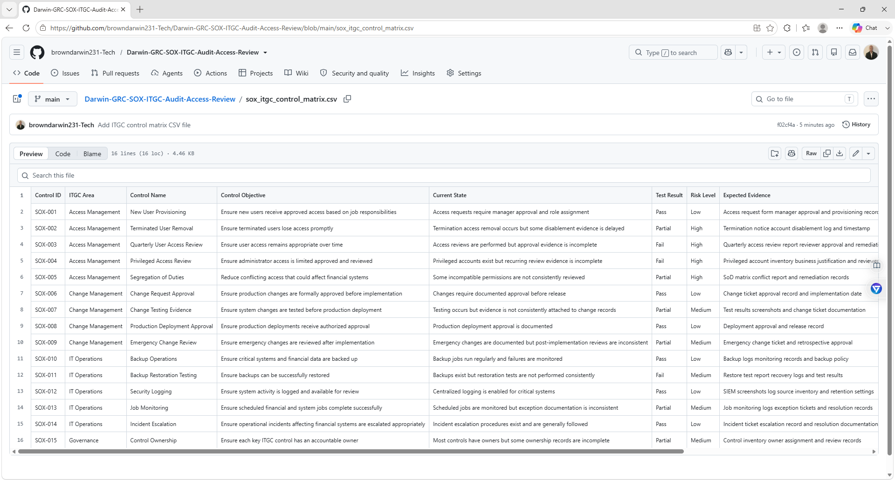
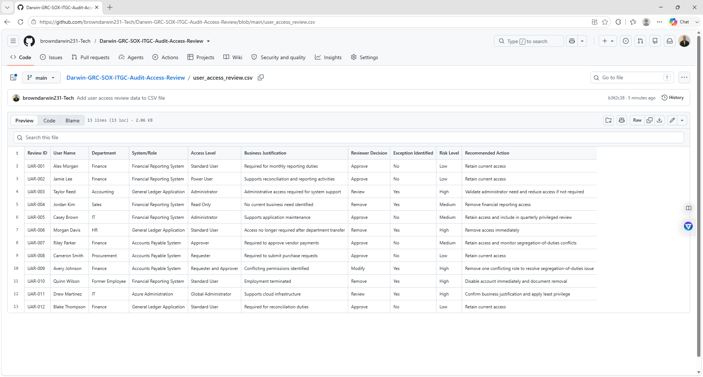
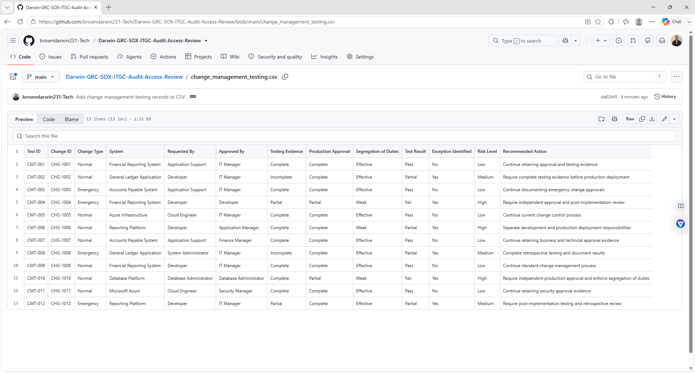

# Darwin-GRC-SOX-ITGC-Audit-Access-Review

## Project Overview

This project simulates a SOX IT General Controls (ITGC) audit for a fictional public company called **CloudNova Financial Systems**.

The goal is to evaluate key IT controls that support financial reporting, including user access management, privileged access, change management, backup operations, and audit evidence.

This project demonstrates practical GRC and IT audit skills including:

- SOX ITGC
- User access reviews
- Privileged access reviews
- Change management testing
- Control testing
- Audit evidence collection
- Exception identification
- Risk assessment
- Remediation planning
- Compliance documentation

## Business Scenario

CloudNova Financial Systems relies on several technology systems that support financial reporting and business operations.

The organization uses:

- Microsoft 365
- Microsoft Azure
- Financial reporting applications
- Role-based access control
- Administrator accounts
- Formal change requests
- Backup systems
- Centralized logging

Because these systems support financial reporting, IT General Controls should be reviewed to confirm that access, system changes, and operational controls are properly managed.

## Audit Scope

The simulated SOX ITGC review focuses on:

- User Access Management
- User Provisioning
- User Termination
- Quarterly Access Reviews
- Privileged Access
- Change Management
- Change Approval
- Segregation of Duties
- Backup Operations
- Backup Restoration Testing
- Security Logging
- IT Operations

## ITGC Control Categories

### Access to Programs and Data

Controls should ensure that only authorized users have access to systems and information.

Examples include:

- User provisioning
- User termination
- Quarterly access reviews
- Privileged access reviews
- Role-based permissions

### Program Changes

Controls should ensure that system changes are approved, tested, documented, and separated from production deployment responsibilities.

Examples include:

- Change requests
- Management approval
- Testing evidence
- Production deployment approval
- Emergency change review

### Computer Operations

Controls should support reliable system operation and recovery.

Examples include:

- Backup monitoring
- Restoration testing
- Scheduled jobs
- Logging
- Incident escalation

## Control Testing Method

Each ITGC control is evaluated using:

1. Control Objective
2. Expected Evidence
3. Sample Selected
4. Test Procedure
5. Test Result
6. Exception Identified
7. Risk Level
8. Recommended Action

## Key Findings

| Control | ITGC Area | Result | Risk |
|---|---|---|---|
| New User Provisioning | Access | Pass | Low |
| Terminated User Removal | Access | Partial | High |
| Quarterly User Access Review | Access | Fail | High |
| Privileged Access Review | Access | Fail | High |
| Change Request Approval | Change Management | Pass | Low |
| Change Testing Evidence | Change Management | Partial | Medium |
| Segregation of Duties | Change Management | Partial | High |
| Backup Operations | IT Operations | Pass | Low |
| Backup Restoration Testing | IT Operations | Fail | Medium |
| Security Logging | IT Operations | Pass | Low |

## Example Audit Finding

### Quarterly User Access Review

**Current State:**  
User access reviews are performed, but one review period lacks complete reviewer approval evidence.

**Result:**  
Fail

**Risk Level:**  
High

**Risk:**  
Users may retain unnecessary or inappropriate access to systems supporting financial reporting.

**Recommendation:**  
Perform quarterly user access reviews and retain evidence showing reviewer approval, removed access, and remediation of exceptions.

## Example Privileged Access Finding

### Administrator Access Review

**Current State:**  
Administrator accounts exist, but recurring review evidence is incomplete.

**Result:**  
Fail

**Risk Level:**  
High

**Recommendation:**  
Maintain a privileged account inventory, perform quarterly reviews, document business justification, and remove unnecessary elevated permissions.

## Example Change Management Finding

### Change Testing Evidence

**Current State:**  
Changes are approved before implementation, but testing evidence is not consistently attached to change records.

**Result:**  
Partial

**Risk Level:**  
Medium

**Recommendation:**  
Require documented test results before production approval.

## Audit Evidence Examples

Evidence may include:

- User access reports
- New user approval records
- Termination records
- Account disablement logs
- Privileged account inventories
- Access review approvals
- Change tickets
- Testing screenshots
- Production approval records
- Backup logs
- Restoration test reports
- Security logging screenshots

## Risk Assessment Method

Risk is evaluated using:

Risk Score = Likelihood × Impact

### Risk Ratings

- 1–4 = Low
- 5–10 = Medium
- 11–15 = High
- 16–25 = Critical

## Remediation Priorities

1. Improve terminated-user access removal
2. Perform complete quarterly user access reviews
3. Formalize privileged-access reviews
4. Improve segregation of duties in change management
5. Require consistent change-testing evidence
6. Perform quarterly backup restoration testing

## Repository Structure

Darwin-GRC-SOX-ITGC-Audit-Access-Review/
│
├── README.md
├── sox_itgc_control_matrix.csv
├── user_access_review.csv
├── privileged_access_review.csv
├── change_management_testing.csv
├── audit_findings.md
├── remediation_plan.md
└── evidence/

## Evidence Screenshots

### SOX ITGC Control Matrix

### User Access Review

### Change Management Testing

## Skills Demonstrated

- SOX ITGC
- Governance, Risk, and Compliance
- IT Audit
- User Access Reviews
- Privileged Access Management
- Change Management
- Segregation of Duties
- Control Testing
- Audit Evidence
- Exception Management
- Risk Assessment
- Remediation Planning
- Compliance Documentation

## Project Goal

The goal of this project is to demonstrate practical SOX ITGC audit skills by reviewing access controls, privileged accounts, system changes, operating controls, audit evidence, exceptions, and remediation actions.
